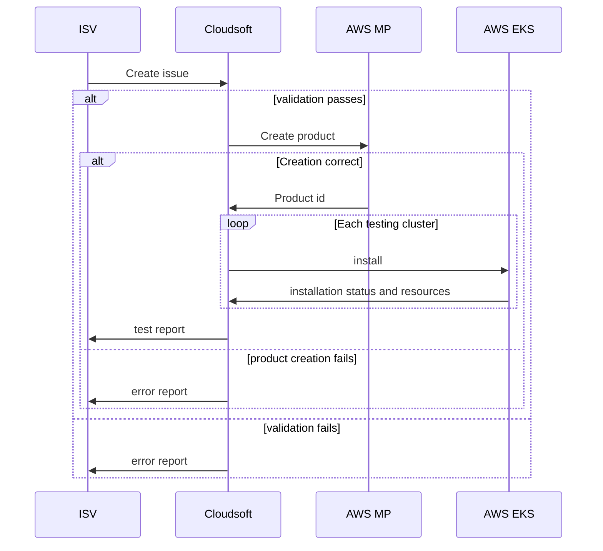

# Automatic add-on installation

## Schema

Details in [automation-pipeline](./automation-pipeline.md)



1. A new issue is created
2. The issue is triaged
3. An action triggers:
    1. A new PR is automatically created containing the issue body
    2. Addon validation
    3. Quick fixes
    4. Request to create product and addon
    5. Wait for 30 min in case something fails on during marketplace pre-validation
    6. Label the issue as `Waiting for request update` (LABEL_WAITING)
4. Periodically check the status of the issues labeled as LABEL_WAITING :
    * Success:
        1. remove tag waiting tag and replaces for (LABEL_SUCCEEDED)
        2. trigger [On Success addon creation actions](../../.github/workflows/D1-on-addon-success.yaml) sending a list
           of the succeeded issues
    * Failure or cancelled:
        1. remove tag waiting tag and replace with (LABEL_FAILED)
    * Other state
        1. nothing
5. When [On Success addon creation actions](../../.github/workflows/D1-on-addon-success.yaml) is triggered, for each
   issue id passed as input parameter, it does the following:
    1. Find the PR associated in the comments
    2. Rebase PR branch with current main
    3. Extract from the issue input a subset of parameters for matching the helm charts used
    4. Create manifest:
        1. `addon-prerequisites` -> addon namespace and external secrets
        2. `addon-installation` -> add-on upbound manifest, one per test cluster
        3. `addon-management-cluster-manifests` -> Kustomizations for installing the addon-prerequisites, one per test
           cluster and one more for the add-on itself, using upbound, on the management cluster
    5. Add values file and generated manifest to the PR (the kustomization targets the branch) and force push it
    6. Apply kustomization and addon installation manifest on management cluster

> **NOTE:** Label string are stored as environment variables on the action, to warranty are common between actions

## Pre-requisites

* **[MANUAL]** Create the `eks-connector-role` role.
  See [guide](https://docs.aws.amazon.com/eks/latest/userguide/add-user-role.html). This role is then used by the CDK
  when creating the management and testing clusters to populate the `aws-auth` config map with entries for authorizing
  the role assumed by the management cluster.
  See [eks-connector-role](https://github.com/cloudsoft-fusion/aws-addon-clusters/blob/main/docs/pre-requisites.adoc)

## Management-cluster set up

* [CDK deploy: EKS blueprints] `ControllerConfig.pkg.crossplane.io` named `aws-config`
* [CDK deploy: EKS blueprints] `Provider.pkg.crossplane.io` named `provider-aws-eks` using `aws-config` ControllerConfig
  from the
  previous step
* [CDK deploy: EKS blueprints] `ProviderConfig.aws.upbound.io` named ProviderConfig referencing credentials from the
  IRSA role
* [CDK deploy: FLUX] ClusterAuth.eks.aws.upbound.io, **one per test cluster** referring to the
  ProviderConfig [Manifests](../../common/testingClusters/test-clusters-clusterAuth.yaml)
* **[MANUAL]** Create a `secret` with the GitHub token to access the git-ops repo, eg:
    ```shell
    kubectl create secret generic github-token --from-literal=password=$GITHUB_TOKEN --from-literal=username=pat -n upbound-system
    ```

## Testing clusters set up

* **[MANUAL]** on each test cluster create a `secret` with the credentials to access AWS Secrets Manager, eg:
    ```shell
    kubectl create secret generic awssm-secret --from-file=./access-key --from-file=./secret-access-key -n secret-manager 
    ```
* **[MANUAL]** on ech test cluster, create
  a `ClusterSecretStore.external-secrets.io`.[Manifest](../../common/resources/testing-cluster/clusterSecretStore.yaml)

[//]: # (* [PIPELINE] [addon-prerequisites]&#40;../../common/addon-prerequisites&#41; resources. Only one set of manifest per add-on)

[//]: # (* [PIPELINE] [addon-installation]&#40;../../common/addon-installation&#41; templates create one `addon.eks.aws.upbound.io` per)

[//]: # (  test cluster)

[//]: # (* [PIPELINE] [addon-management-cluster-manifests**]&#40;../../common/addon-management-cluster-manifests&#41; templates create:)

[//]: # (    * One `GitRepository.source.toolkit.fluxcd.io` per add-on)

[//]: # (    * A `Kustomization.kustomize.toolkit.fluxcd.io` per testing cluster for installing the add-on prerequisites)

[//]: # (    * Ono `Kustomization.kustomize.toolkit.fluxcd.io` per add-on for installing the addon using upbound)

## TODO

* [ ] Set target test cluster based in the value of the issue input `kubernetesVersion`
* [ ] Remove resources once PR is merged
* [ ] Create kustomization targeting `main` branch instead of feature branch, per open PR

## Troubleshooting commands

For the kustomization to be applied on the test-clusters, the `management-cluster` needs to have access to them. That
involves the IRSA role correctly configured and the `clusterauth` correctly created.

They are created using the global git-repo added on the cdk deployment using
the [clusterAuth](../../common/testing-cluster-resources/templates/clusterAuth.yaml) manifest in the path.

Get `clusterAuth` details:

```shell
kubectl describe clusterauth addon-tester-amd-1-28-blueprint -n upbound-system
```

### Flux

Install FluxCD

```shell
brew install fluxcd/tap/flux 
```

Check flux resources

```shell
flux get all -A
```

Notice the name for the git repositories and kustomizations are prefixed with the `kind`; for the `reconcile` command it
needs to be removed and use only the name.

Reconcile git-repository:

```shell
NAMESPACE=upbound-system # default
flux reconcile source git $GIT_REPOSITORY_NAME  -n $NAMESPACE 
```

Reconcile flux kustomization:

```shell
NAMESPACE=upbound-system # default
flux reconcile kustomization $KUSTOMIZATION_NAME -n $NAMESPACE 
```

## List installed add-ons

```shell
TEST_CLUSTERS=(
"amd-1-26-blueprint"
"arm-1-26-blueprint"
"amd-1-29-blueprint"
"arm-1-29-blueprint"
"amd-1-28-blueprint"
"arm-1-28-blueprint"
)
AWS_REGION=eu-west-3
for CLUSTER_NAME in "${TEST_CLUSTERS[@]}" ;do
  eksctl get addons --cluster $CLUSTER_NAME  --region $AWS_REGION
done
```
