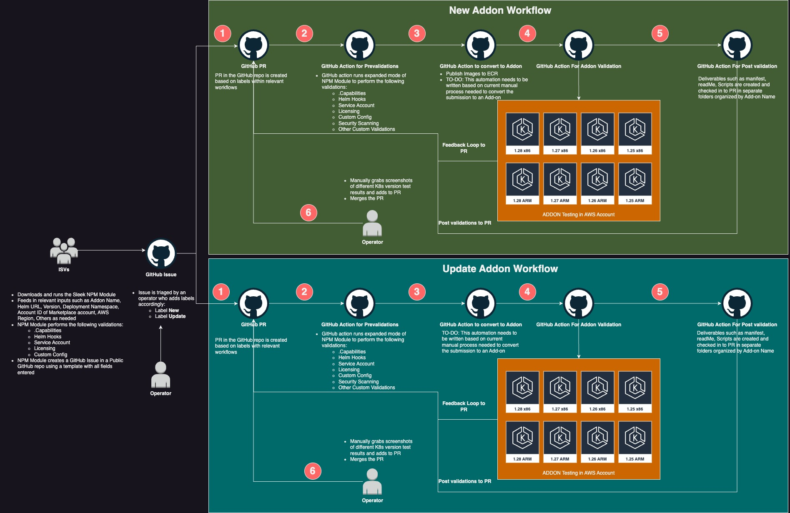

# Workflow Design

This is a quick description of the idea for workflow design. The workflows are present in directory `.github/workflows`, 
where we can find two workflows:
* [Process Issue](../../.github/workflows/1-process-issue-auto-assign-label.yaml) - assign label and trigger relevant workflow
* [Create/Update Addon Workflow](../../.github/workflows/2-process-addon.yaml)

The workflows are based on the following flow diagram:

# Process Issue Workflow

The first workflow to run is the **Process Issue** workflow.
It is triggered to run when a new issue in repository is created.

The workflow can run some logic to determine if the addon in the issue is a new addon or an existing addon update.
The checks could involve checking the relevant directories within the repository. If no addon is found there, then we
can consider that it is a new addon. If an addon exists, we can check for the version in the repository and compare it
against the version set in the issue. To be considered an update, `new_version` > `current_version`.

We can additionally check the marketplace to see if the addon product already exists there. It can help us to evaluate
whether the addon is a new addon or update of existing addon.

In the easiest approach, we can introduce a parameter in the input params for user to specify if addon is new or existing.
Ultimately, the user will know if they already have an addon product or not, so that might be the simplest solution.

After establishing whether the addon is `NEW`, or `UPDATE`, workflow assigns the relevant label to the issue.

# Create / Update Addon workflow

After the `Process Issue` workflow is completed and a relevant label is added in the issue, the next workflow to kick off
is the **Create/Update Addon** workflow. 
There might be a better way to handle this, but in this design both workflows are triggered based on the completion of 
the initial workflow and the label being added to the issue. First step of the workflow is to check for presence of a 
respective label. If not present, the workflow exits without any further work. This can help to ensure that only the relevant 
workflow actually does any work.

As per the flow diagram above, the workflows carry out the relevant actions to verify, create and test the addon, 
followed by generating the deliverables and supplying them to the PR. Therefore, the workflow should carry out the
following actions:
* Create a PR for the Addon
* Run the validation checks on the helm chart
* Covert the resources to an addon product
* Test the addon on different EKS cluster versions/architectures
* Generate the deliverables and push them to the PR
* (optional) Notify the operator/user about progress

The flow above is a rough sketch of the required steps, and it is subject to change and mainly implementation. 
The following flow appears to be greatly automated and reduce the involvement of the operator to 
verifying and merging the resulting PR, which would be a great automation of the process.